# Haoran Wei (whaoran)

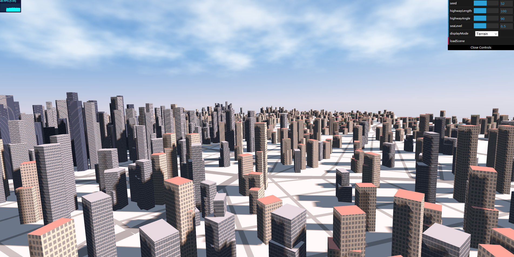

## Demo
[Demo Page](https://whaoran0718.github.io/hw06-city-generation/)

## Techniques
### Terrain and Road Generation
I implement procedural terrain and road generation based on the paper of [CityEngine](proceduralCityGeneration).
A previous version is [here](https://whaoran0718.github.io/hw05-road-generation/).
In the final version, I rasterize every roads onto the map based on traditional rasterization method for triangles.
Then, I extract valid pixels where no roads or sea overlap and separate them into independent groups (i.e. blocks) where
streets emerge. Now, streets won't overlap in a block.

Final Result
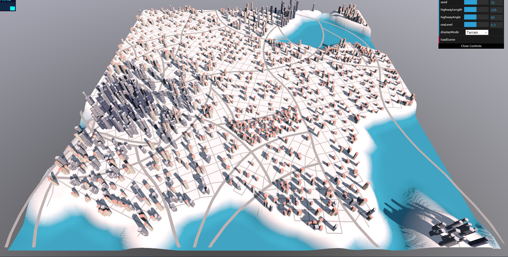

Highway Blocks
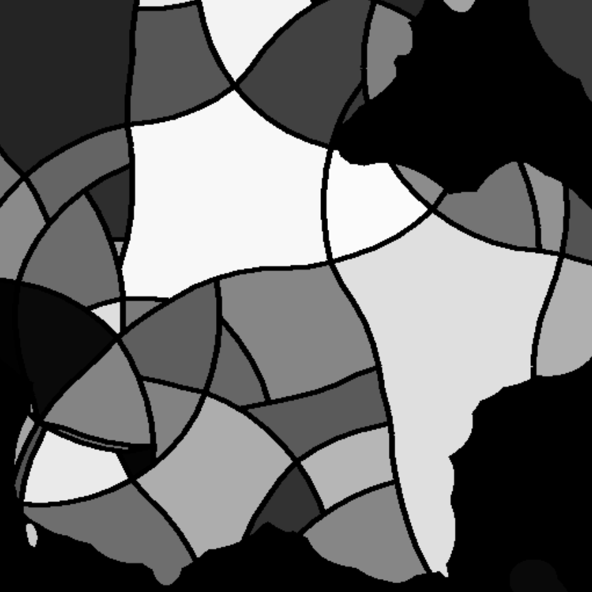

Distincts
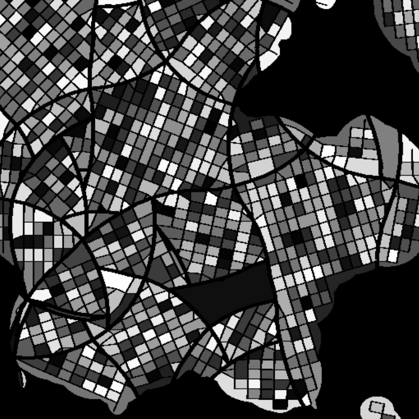

### Building Grids
The entire map is divided into small grids where the program could set up buildings. Only those grids which have no intersection with roads or sea are valid. Then, the code randomly chooses some grids to set up procedural buildings.

Valid Grids with Roads
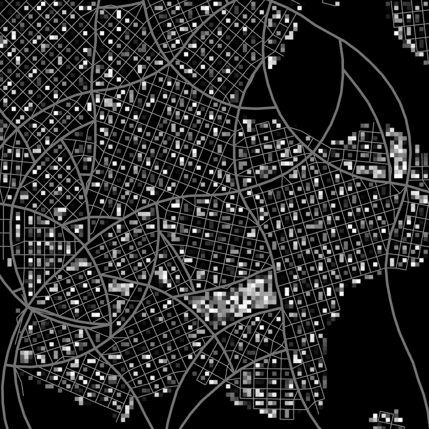

### Building Generation
The method of procedural 3D building generation is introduced in the paper [Real-time Procedural Generation of 'Pseudo Infinite' Cities](procedural_infinite_cities.pdf). The basic algorithm is to procedurally generate a series of polygons when extruding from ceiling to floor along with union operation and random bias around base point.

In my project, the appearance of building varies from areas with high population density to low. In areas of lower density, buildings are more like houses. They are almost cuboid, short and with fewer layers or floors. By contrast, in areas of higher denstiy, buildings are more like skyscrapers with more faces and floors, and considerably taller than those houses. In the transition areas, there are more offices with a mixed appearance. Moreover, lower density of population, lower density of buildings, and vice versa. 

Textures varies from high density to low as well. In this project, three different types of building textures are simply applied on correspounding building geometries.

Houses
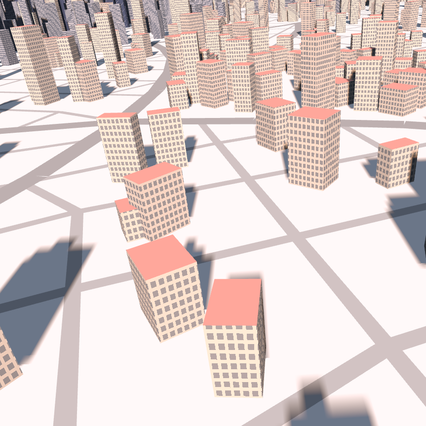

Offices
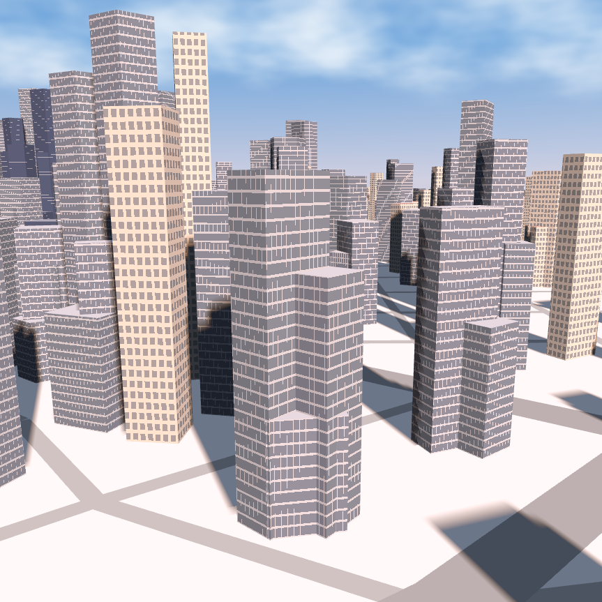

Skyscrapers
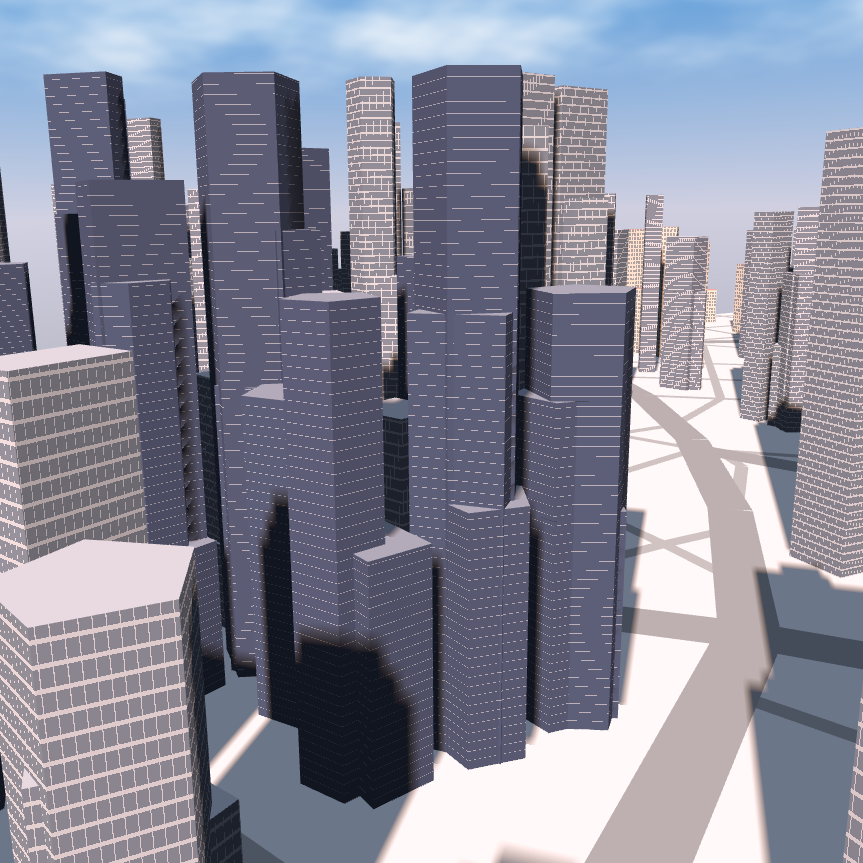

Distribution with Population
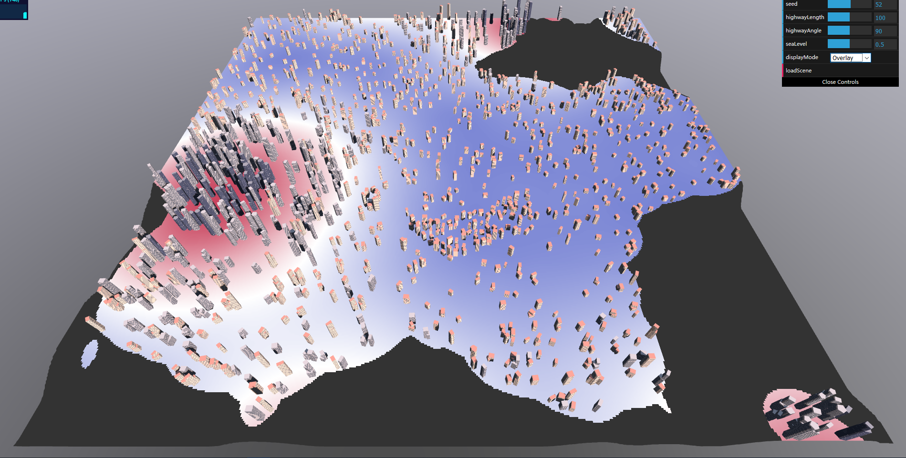

### Lighting
Use shadow map to generate shadows for the scene. Only direction light from the sun casts shadows. A bluish indirection light is simply from up to down to color the shadow.

### Procedural Sky
Use FBM Perlin noise to generate a procedural flowing cloud.

## Reference
 - [Real-time Procedural Generation of 'Pseudo Infinite' Cities](procedural_infinite_cities.pdf)
 - [CityEngine](proceduralCityGeneration)
 - [IQ's article on artistic lighting](http://iquilezles.org/www/articles/outdoorslighting/outdoorslighting.htm)

## Issue
It may crash the browser sometimes. Refresh the browser could solve the issue temporarily.

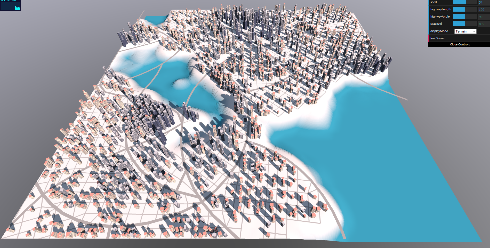

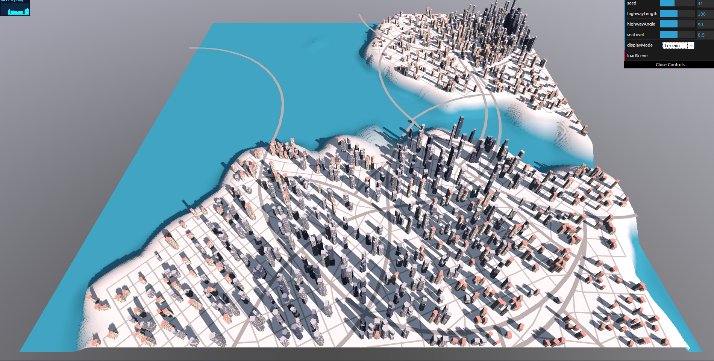
